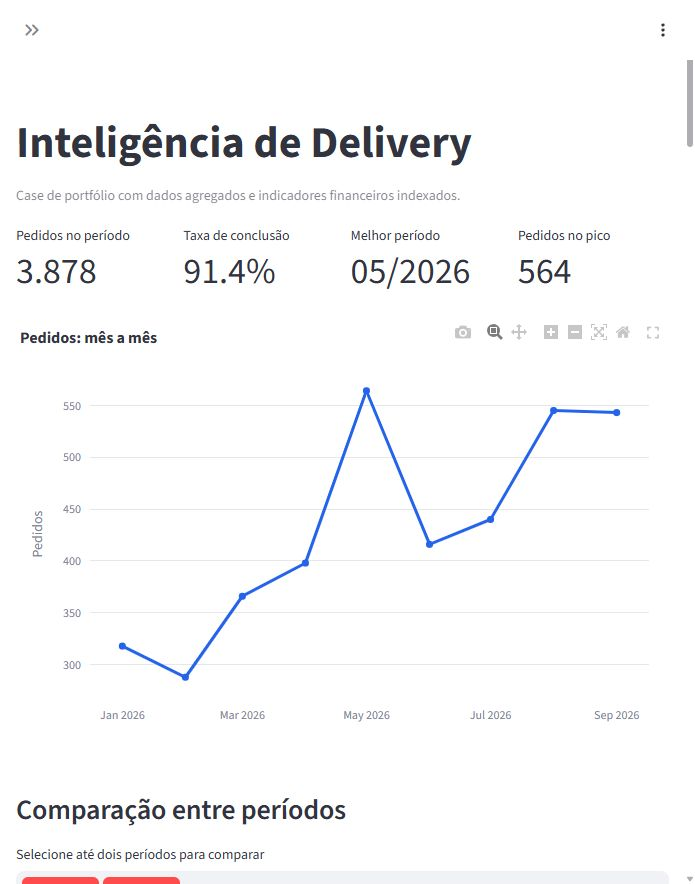

# Análise e previsão de demanda de delivery

Neste projeto de Ciência de Dados, transformei exportações de pedidos e clientes em indicadores operacionais, análises de recorrência e previsões diárias de pedidos e faturamento. Organizei o fluxo de tratamento de dados, análise exploratória, modelagem, dashboard interativo e publicação com Docker.

Desenvolvi este case com dados reais de uma operação de delivery. A versão pública utiliza agregações sem identificadores pessoais e com valores financeiros indexados.

**[Acessar o dashboard](https://analise-delivery.pedromerli.com/)** · **[Código no GitHub](https://github.com/pedrokamerli/analise-delivery)**

## Objetivo

Meu objetivo foi organizar o histórico da operação para apoiar decisões sobre demanda, capacidade de atendimento e relacionamento com clientes. As perguntas que orientaram a análise foram:

- Como o volume de pedidos varia por mês, semana, dia e horário?
- Qual é a proporção de pedidos concluídos e como ela muda entre períodos?
- Em quais horários o tempo de preparo exige atenção?
- Quais segmentos de clientes podem orientar ações de retenção e reativação?
- Quantos pedidos e qual faturamento podem ser esperados nos próximos dias?

As previsões são estimativas para planejamento. O projeto não mede o efeito de intervenções comerciais nem demonstra ganhos de faturamento decorrentes do uso do dashboard.

## Base analisada

| Indicador | Base atual |
|---|---|
| Período dos pedidos | 01/01/2026 a 30/09/2026 |
| Pedidos registrados | 3.878 |
| Dias com registros | 194 |
| Taxa de conclusão | 91,4% |
| Maior volume mensal | Maio de 2026: 564 pedidos |

Os números descrevem a exportação disponível e podem mudar após uma atualização. A taxa de conclusão considera os status registrados na exportação, incluindo pedidos ainda em andamento no denominador.

As fontes locais são uma planilha de pedidos, uma planilha de clientes e um PDF de avaliações. O PDF não possui texto estruturado suficiente para uma análise de sentimentos confiável; essa limitação foi registrada na auditoria.

## Dashboard



- **Análise temporal:** filtros por intervalo de datas e visualizações mensais, semanais e diárias.
- **Comparação de períodos:** volume, conclusão, índices financeiros e pedidos por dia observado, com aviso para períodos parciais.
- **Operação:** distribuição por horário e status, tempo mediano de preparo e percentil 90.
- **Clientes:** segmentação RFM por recência, frequência e valor histórico das compras.
- **Previsões:** estimativas para horizontes de 7 a 28 dias, comparação de modelos, erros de validação e faixas empíricas de erro.
- **Atualização e exportação:** importação local de pedidos em Excel, upload de séries agregadas em CSV e download das séries e previsões.

A segmentação RFM representa o cadastro de clientes disponível. Ela não é recalculada por filtros de datas ou uploads de CSV diário. As agregações de preparo também não são filtradas por data no painel.

## Metodologia

Usei o **CRISP-DM** como referência para estruturar o trabalho:

| Etapa | Aplicação no projeto |
|---|---|
| Entendimento do negócio | Perguntas sobre demanda, operação e clientes |
| Entendimento dos dados | Inspeção das exportações, cobertura temporal e qualidade dos registros |
| Preparação | Conversão de datas, tratamento de campos, definição de pedidos concluídos e agregações |
| Modelagem | Segmentação RFM e comparação de métodos de previsão por alvo |
| Avaliação | Validação cronológica, MAE, RMSE e registro das limitações |
| Implantação | Dashboard Streamlit, dados públicos indexados e execução na VPS com Docker |

Na análise operacional, sinalizei durações fora da faixa de 0 a 180 minutos como inconsistentes. No histórico de clientes, reconstruí os atributos a partir de pedidos anteriores à data de cada observação.

## Previsão de pedidos e faturamento

Os alvos são modelados separadamente:

- **Pedidos:** quantidade de pedidos registrados por dia.
- **Faturamento:** soma de `TOTAL` dos pedidos com status `Entregue`, `Retirado` ou `Avaliado`, agrupados pela data do pedido. Não representa lucro, margem ou fluxo de caixa.

No modelo, uso calendário, tendência, último valor observado, médias dos últimos 7 e 28 dias e contagem de observações nessas janelas. Quando disponíveis, acrescento atributos agregados dos 28 dias anteriores: clientes ativos, clientes que repetiram pedidos, frequência média e ticket histórico.

Normalizo os telefones somente em memória para reconstruir o histórico e verificar a cobertura do cadastro. Não exporto identificadores na série diária nem uso totais atuais do cadastro como se fossem conhecidos em datas passadas.

### Modelos e avaliação

Comparo um **Random Forest Regressor** com uma **média histórica por dia da semana**. O Random Forest utiliza 150 árvores, mínimo de 5 observações por folha e semente 42.

Avalio os métodos em três janelas cronológicas, cada uma com o mesmo horizonte escolhido para a projeção. Em cada janela, treino apenas com datas anteriores à sua origem. Avanço as médias de demanda com previsões recursivas e mantenho o contexto dos clientes congelado na origem, sem consultar compras futuras.

Escolho o método com menor **MAE médio** para cada alvo e também apresento o **RMSE**. Na base até 30/09/2026, com horizonte de 14 dias e sem preencher dias ausentes com zero, obtive os seguintes resultados arredondados:

| Alvo | Média por dia da semana — MAE | Random Forest — MAE |
|---|---:|---:|
| Pedidos | 5,64 pedidos/dia | 4,69 pedidos/dia |
| Faturamento público | 3,34 pontos de índice/dia | 3,22 pontos de índice/dia |

Nessa configuração, o Random Forest foi selecionado para os dois alvos. A seleção pode mudar conforme a base, o horizonte e o tratamento dos dias ausentes. As mesmas janelas são usadas para comparação e seleção; esses resultados não constituem um teste final independente.

Construo as faixas com o percentil 90 dos erros absolutos de validação, com limite inferior zero. Uso essas faixas como referências empíricas por dia, sem garantia de cobertura. Não somo os limites diários para apresentar um intervalo do total do período.

## Privacidade e versão pública

| Conteúdo | Tratamento |
|---|---|
| Planilhas originais, nomes, telefones e endereços | Permanecem localmente; excluídos do Git e da imagem Docker |
| Bases tratadas e faturamento em reais | Uso local; excluídos do Git e da imagem Docker |
| Agregações em `dados/publicos` | Publicadas sem identificadores e com valores financeiros indexados ou omitidos |
| Upload no site público | Aceita CSV agregado e altera apenas a sessão do visitante |

Na previsão pública, indexo o faturamento para que a soma do primeiro mês com receita positiva seja 100. Também indexo o ticket histórico. Assim, apresento variações sem publicar os valores absolutos em reais.

A variável `DELIVERY_PUBLICO=1` ativa a demonstração pública, bloqueando a importação de valores em reais e o salvamento no servidor. A planilha Excel de pedidos deve ser importada na aplicação local.

## Tecnologias

| Finalidade | Tecnologias |
|---|---|
| Tratamento e análise | Python, pandas, NumPy e openpyxl |
| Modelagem | scikit-learn |
| Visualização | Plotly, Matplotlib e Seaborn |
| Aplicação | Streamlit |
| Auditoria de PDF | pypdf |
| Validação | pytest |
| Versionamento e implantação | Git, GitHub, Docker Compose, Nginx e VPS |

## Como executar

### Demonstração com os dados públicos

Não é necessário ter as planilhas do cliente para executar o dashboard público. No PowerShell:

```powershell
git clone https://github.com/pedrokamerli/analise-delivery.git
cd analise-delivery
python -m venv .venv
.\.venv\Scripts\Activate.ps1
python -m pip install -r requirements.txt
$env:DELIVERY_PUBLICO = "1"
python -m streamlit run dashboard/app.py --server.port 8513
```

Abra o endereço exibido pelo Streamlit, normalmente `http://localhost:8513`. Se a porta estiver ocupada, escolha outra disponível.

### Análise completa com os arquivos privados

Coloque em `dados/brutos` uma exportação `Pedidos - *.xlsx`, uma `Planilha de clientes - *.xlsx` com a aba `CLIENTES` e o PDF de avaliações. O fluxo completo exige os arquivos e o esquema da exportação original.

```powershell
$env:DELIVERY_PUBLICO = "0"
python main.py
python -m streamlit run dashboard/app.py --server.port 8513
```

O comando `main.py` gera bases tratadas, gráficos, relatório local e agregações públicas. Na visão local, a aba de previsão de pedidos e faturamento apresenta valores em reais.

## Atualização de pedidos

No dashboard local, use **Importar pedidos do sistema (Excel)** e envie a nova exportação `.xlsx`. Também é possível executar:

```powershell
python atualizar_pedidos.py "C:\caminho\Pedidos - nova-exportacao.xlsx"
```

A importação combina os pedidos pelo ID: preserva os antigos, atualiza IDs repetidos e inclui novos registros. Isso permite importar uma exportação parcial sem apagar os meses anteriores. IDs ausentes, duplicados e esquemas incompatíveis são rejeitados.

O consolidado local fica em `dados/brutos` em um arquivo `.pkl` gerado pelo projeto. A exportação original é preservada; backups ficam em `dados/atualizacoes/backups`. A importação regenera as agregações e os atributos históricos usados nas previsões. O cadastro e a segmentação RFM continuam referentes à exportação de clientes disponível.

O upload público aceita apenas CSV agregado e não altera permanentemente a base publicada. O painel fornece um modelo com as colunas necessárias. Para atualizar o site, é necessário versionar os arquivos regenerados de `dados/publicos` e reconstruir o contêiner.

## Estrutura do repositório

```text
analise-delivery/
├── dashboard/app.py          # Interface Streamlit
├── dados/
│   ├── brutos/               # Fontes privadas e consolidado local; fora do Git
│   ├── tratados/            # Bases locais geradas; fora do Git
│   ├── atualizacoes/        # Séries salvas e backups; fora do Git
│   └── publicos/            # Agregações usadas na demonstração
├── documentacao/            # Narrativa, metodologia e imagem do dashboard
├── imagens/                 # Gráficos gerados localmente
├── relatorios/              # Relatório gerado localmente
├── src/                     # Carga, tratamento, análise, importação e previsão
├── testes/                  # Testes de validação e modelagem
├── main.py                  # Fluxo completo da análise
├── atualizar_pedidos.py     # Importação incremental de pedidos por ID
├── Dockerfile
├── docker-compose.yml
└── requirements.txt
```

## Testes e implantação

```powershell
python -m pytest testes -q
```

Os testes verificam regras de CSV, combinação de pedidos, indexação financeira e comportamento das previsões. Incluem um cenário que altera dados futuros para verificar que eles não modificam projeções de uma janela anterior.

Publiquei a aplicação com Docker Compose e o Nginx compartilhado da VPS. Para reduzir o uso de disco, configurei o `Dockerfile` para herdar a imagem `observatorio-municipios-observatorio-municipios:latest`, já disponível nesse servidor. O build depende dessa imagem: outra máquina precisa disponibilizá-la ou adaptar a imagem-base e as dependências. Documentei acima a execução com ambiente Python, que independe dessa infraestrutura.

## Limitações e próximos passos

- Dias sem registro não significam automaticamente zero pedidos. Sem calendário de abertura, a previsão deve ser interpretada como demanda em dias de operação.
- A projeção começa após a última data da base, que pode estar defasada em relação à data atual.
- Os status são um retrato da exportação. Sem histórico de mudanças, a avaliação não reproduz integralmente o que era conhecido em cada data. Pedidos recentes ainda abertos podem subestimar o faturamento.
- Recorrência e frequência dependem do período disponível. O cadastro de clientes é um retrato separado e não acompanha automaticamente novas exportações de pedidos.
- Clima, promoções, feriados e mudanças de capacidade não entram no modelo atual.
- Sem itens, custos e margens, não é possível avaliar rentabilidade por produto.

Pretendo incorporar essas fontes, acrescentar um período final independente para avaliação e tornar a imagem Docker independente da infraestrutura atual.

## Documentação complementar

- [Narrativa do case](documentacao/narrativa_do_case.md)
- [Modelo de demanda](documentacao/modelo_demanda.md)
- [Previsão com histórico de clientes e pedidos](documentacao/previsao_pedidos_faturamento.md)

**Autor:** [Pedro Merli](https://github.com/pedrokamerli).
